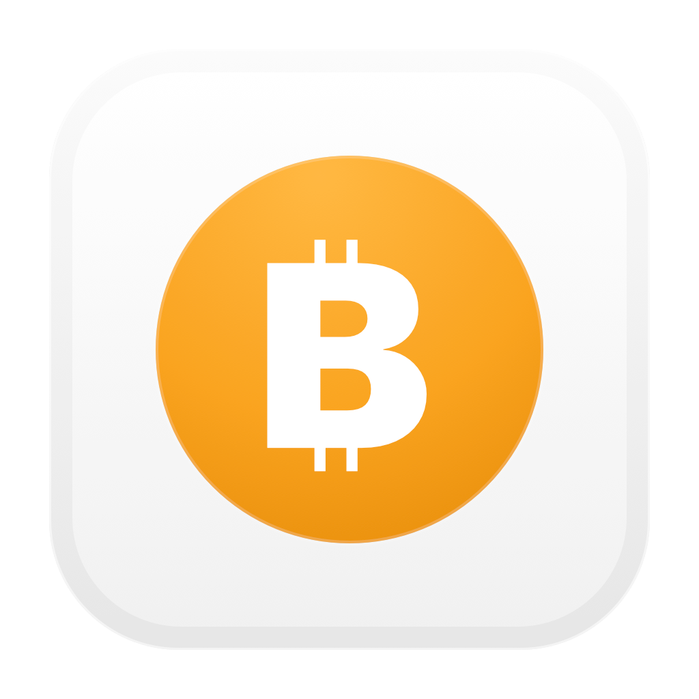

# BTCMenu

Menu bar app nativo para macOS, feito em Swift + AppKit, para acompanhar o preço do BTC.



## O que o app faz

- mostra o preço atual do BTC direto na menu bar
- alterna entre `USD` e `BRL`
- atualiza automaticamente a cada 60 segundos
- permite atualização manual
- usa uma API pública sem exigir configuração inicial
- usa CoinMarketCap quando a API key estiver configurada
- salva API key, moeda e alertas em `UserDefaults`
- dispara alertas por preço-alvo ou variação em `1h`, `3h` e `24h`

## Requisitos

- macOS 13+
- Swift 6
- API key da CoinMarketCap é opcional

## Desenvolvimento

```bash
swift build
swift run BTCMenu
```

## Gerar `.app`

```bash
./scripts/build_app.sh
```

O bundle será gerado em `dist/BTCMenu.app`.

## Atalhos com Make

```bash
make build
make run
make dmg
make zip
make release
```

Para criar e publicar uma tag de release:

```bash
make tag VERSION=1.0.0
```

O GitHub Actions publica releases para tags no formato `v*`, anexando `BTCMenu.dmg` e `BTCMenu.app.zip`.

## Estrutura

- `Package.swift`: definição do Swift Package
- `Sources/BTCMenuApp`: entrypoint AppKit
- `Sources/BTCMenuCore`: app delegate, UI, estado, rede e persistência
- `scripts/build_app.sh`: empacotamento do `.app`
- `scripts/generate_app_icon.swift`: geração do ícone do bundle

## Arquitetura

O projeto foi refeito usando a mesma ideia estrutural do app `wake`:

- `NSApplication` com `LSUIElement` para rodar só na menu bar
- `NSStatusItem` e `NSMenu` para a interface
- `URLSession` para buscar cotações em API pública e, opcionalmente, na CoinMarketCap
- `UserDefaults` para persistência
- `UNUserNotificationCenter` + `NSSound` para alertas
